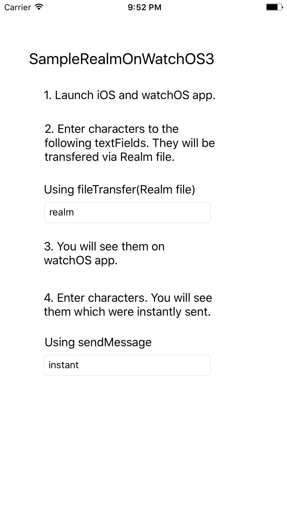
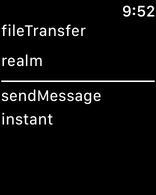

# SampleRealmOnWatchOS3
A demo how to use transferFile with Realm for sharing Realm data between iOS 10 and watchOS 3.
In order to compare it and sendMessage, this project contains code of sendMessage.

## Screenshots

## Steps
1. clone it.
2. `pod update` for importing realmSwift.
3. Run and launch the watchOS app.
4. Launch the iOS app.

## Required
Swift 3, Xcode 8+

## Author
Yuta Hoshino @hsylife
